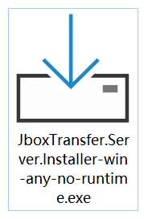
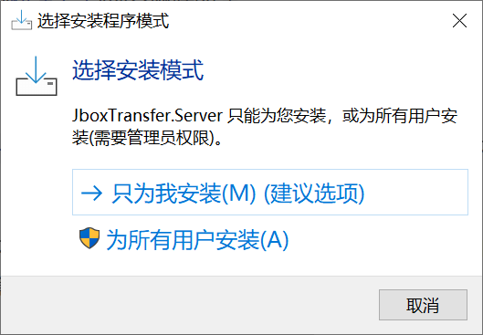
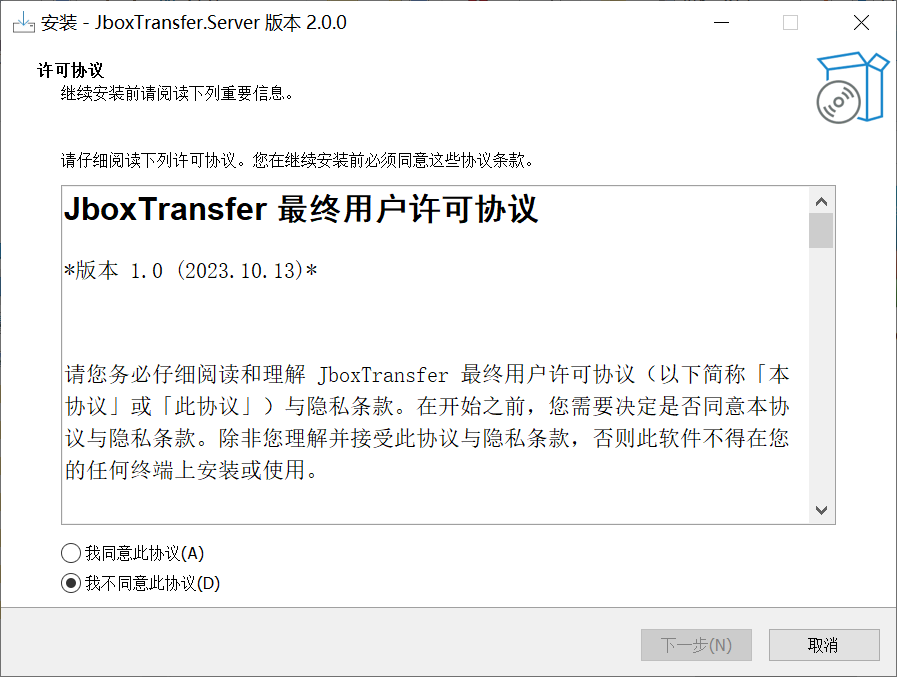
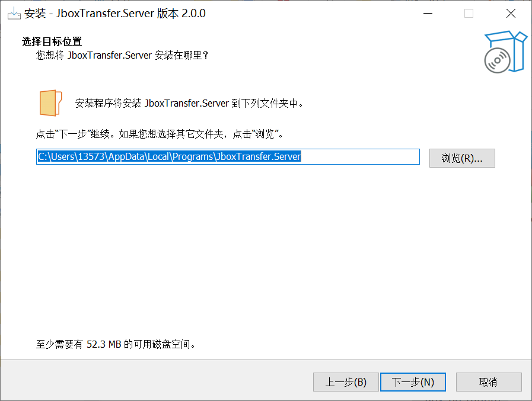
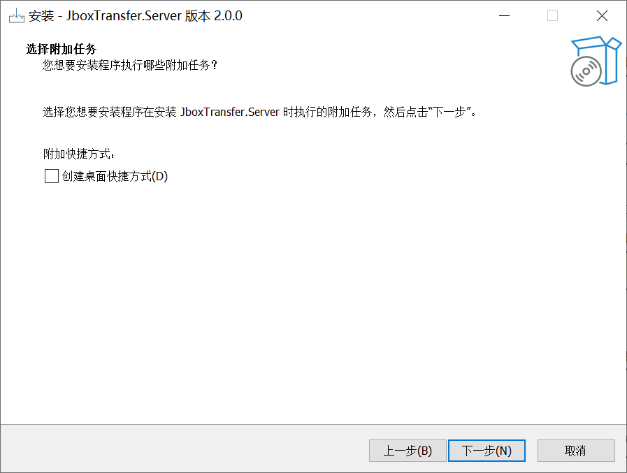
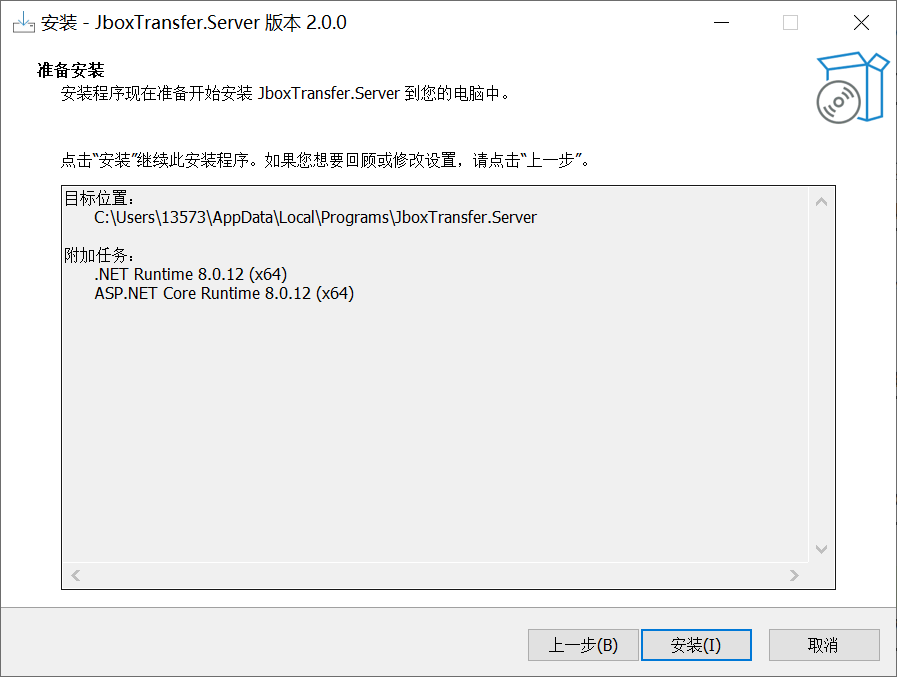
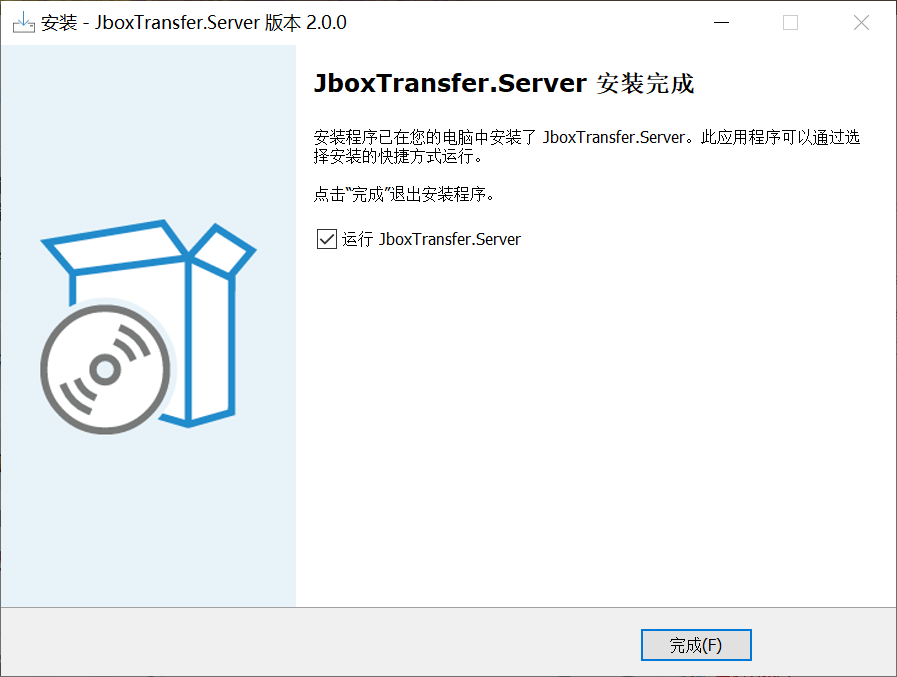

# 下载 JboxTransfer
## 在 Windows 上运行
1、点击下面的链接下载：
<div class="tip custom-block" style="padding-top: 16px; padding-bottom: 16px;font-size: 24px; line-height: 30px">

[Windows x86&x64 安装包](https://pan.sjtu.edu.cn/jboxtransfer/bin/JboxTransfer.Webview2.Installer-win-any-no-runtime.exe)
</div>

2、双击运行下载的安装包文件


3、选择安装模式，如果您不知道这是什么，点击“只为我安装”


4、阅读最终用户许可协议，选择“我同意此协议”，点击“下一步”


5、选择安装位置，**强烈建议保持默认**（如果您想选择一个非系统盘目录，或许您需要[便携版应用](#所有二进制版本)而不是安装版），点击“下一步”


6、选择是否要创建桌面快捷方式，点击“下一步”


7、点击“安装”开始安装，期间需要联网安装 .NET 运行库，请保持网络畅通


8、完成安装


接下来，您可能想转到“[快速上手](./quickstart)”部分继续阅读。


### 其他二进制版本
除了上面提供的`统一安装包-在线安装依赖库`版本外，开发者还提供其他程序版本以供有特殊需求的用户使用。

其中`自带依赖库`的版本自带了 `ASP.NET 8.0` 环境，如果您选择`无依赖库`的版本，可能需要 `ASP.NET 8.0` 运行环境，可以点击[这里](https://dotnet.microsoft.com/zh-cn/download/dotnet/thank-you/runtime-aspnetcore-8.0.13-windows-x64-installer)下载。

|类型|下载点①|下载点②|下载点③|
|---|---|---|---|
|Windows 统一安装包-在线安装依赖库|[直链](https://pan.sjtu.edu.cn/jboxtransfer/bin/JboxTransfer.Webview2.Installer-win-any-no-runtime.exe)|[jBox](https://jbox.sjtu.edu.cn/l/4HHIxJ)|[pan](#)|
|Windows 64位便携版-无依赖库|[直链](https://pan.sjtu.edu.cn/jboxtransfer/bin/JboxTransfer.Server-win-x64-no-runtime.zip)|[jBox](https://jbox.sjtu.edu.cn/l/H1DdL9)|[pan](#)|
|Windows 64位便携版-自带依赖库|[直链](https://pan.sjtu.edu.cn/jboxtransfer/bin/JboxTransfer.Server-win-x64-with-runtime.zip)|[jBox](https://jbox.sjtu.edu.cn/l/UHomt7)|[pan](#)|

更多版本可以在 [Github Releases](https://github.com/1357310795/JboxTransfer) 找到。

## 在 macOS 上运行
1、点击下面的链接下载：
<div class="tip custom-block" style="padding-top: 16px; padding-bottom: 16px;font-size: 22px; line-height: 36px">

[使用 Apple Silicon (M系列) 的新版 mac](https://pan.sjtu.edu.cn/jboxtransfer/bin/JboxTransfer.Server-osx-arm64-with-runtime.zip)<br/>或者<br/>[使用 Intel CPU 的旧版 mac](https://pan.sjtu.edu.cn/jboxtransfer/bin/JboxTransfer.Server-osx-x64-with-runtime.zip)
</div>

2、在访达中找到下载的文件，双击后自动解压到同名文件夹（后面为了步骤清晰，文件夹改名为 `JboxTransfer.Server-osx`）


3、不要打开文件夹，而是在文件夹上右键，选择“新建位于文件夹位置的终端窗口”（如果没有这个选项，可以参考[这篇文章](https://zhuanlan.zhihu.com/p/700711063)）


4、打开终端后，输入下面的命令，按下回车，为文件赋予可执行权限

**输入命令务必注意大小写！**

```
chmod +x ./JboxTransfer.Server
```


5、输入命令，移除影响使用的文件属性

```
xattr -rd com.apple.quarantine .
```


6、输入命令，为文件生成临时签名

```
codesign -fs - --deep ./JboxTransfer.Server
```


7、最后，输入命令启动程序

```
./JboxTransfer.Server
```


8、等待软件启动完毕，提示需在浏览器打开。在 Safari 中打开 [http://127.0.0.1:11896](http://127.0.0.1:11896)


接下来，请您转到“[快速上手](./quickstart)”部分继续阅读。

## 在 Linux 上运行
请从 [Github Releases](https://github.com/1357310795/JboxTransfer) 下载对应版本后，直接运行。如果您选择无依赖库的版本，可能需要先[安装依赖库](https://dotnet.microsoft.com/zh-cn/download/dotnet/8.0)。

运行命令：
```
./JboxTransfer.Server
```

## 在树莓派等设备上运行
这是完全可行的，但是您可能需要安装 SDK 并从源码构建。请自行查阅相关资料。

## 从源码构建
JboxTransfer 是开源软件，如果您对软件的安全性或者上面提供的二进制版本有顾虑，可以前往[开源代码仓库](https://github.com/1357310795/JboxTransfer)进行源码审查，然后自行编译运行。

## 安装时错误
若您在安装过程中遇到困难，请在[代码仓库](https://github.com/1357310795/JboxTransfer)提起 Issue 或者致信 pan@sjtu.edu.cn。